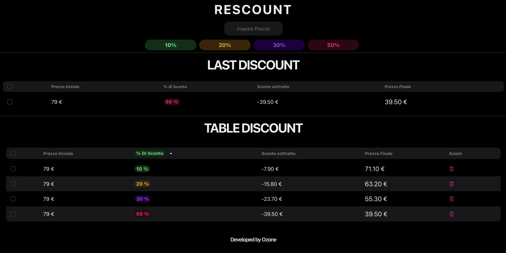

# Rescount 🧾

Rescount è una semplice ma potente applicazione per calcolare sconti. Inserisci un prezzo, applica uno sconto e vedi immediatamente il risultato. Tieni traccia dei tuoi calcoli in una comoda tabella.



## ✨ Funzionalità

- **Calcolo Rapido**: Inserisci un prezzo e seleziona una percentuale di sconto per vedere subito il prezzo finale.
- **Tabella Cronologia**: Ogni calcolo viene aggiunto a una tabella per un facile riferimento.
- **Filtri per Sconto**: Filtra la tabella per visualizzare solo i calcoli con una specifica percentuale di sconto.
- **Eliminazione Singola**: Rimuovi i singoli calcoli dalla tabella.
- **Tema Scuro**: Un'interfaccia elegante e piacevole per gli occhi.

## 🚀 Tecnologie Utilizzate

- [React](https://reactjs.org/)
- [NextUI](https://nextui.org/) per i componenti dell'interfaccia utente.
- HTML & CSS

## 🏁 Iniziare

Per eseguire il progetto in locale, segui questi passaggi:

1.  Clona la repository:
    ```sh
    git clone https://github.com/tuo-username/rescount.git
    ```
2.  Installa le dipendenze:
    ```sh
    npm install
    ```
3.  Avvia l'applicazione in modalità di sviluppo:
    ```sh
    npm start
    ```
    Apri [http://localhost:3000](http://localhost:3000) per vederla nel browser.

## 👨‍💻 Sviluppato da

- **Ozone**

---

_Questo progetto è stato inizializzato con [Create React App](https://github.com/facebook/create-react-app)._ 